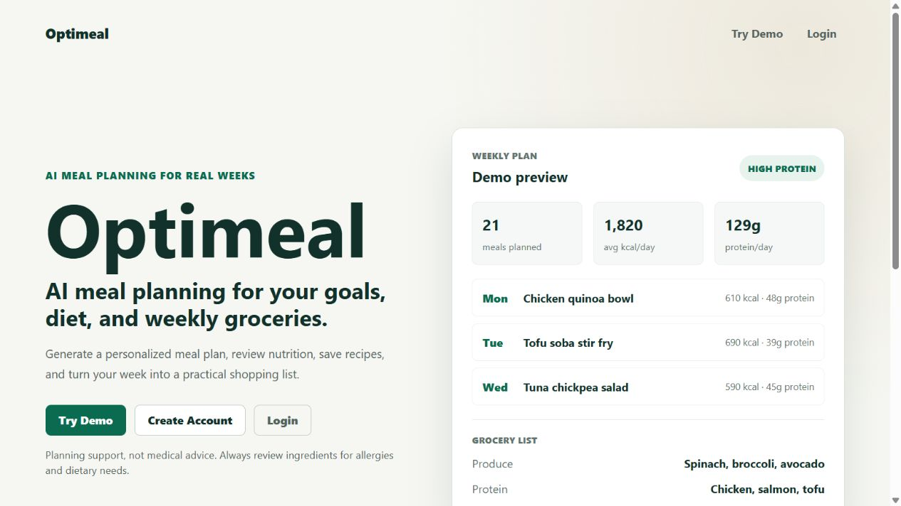
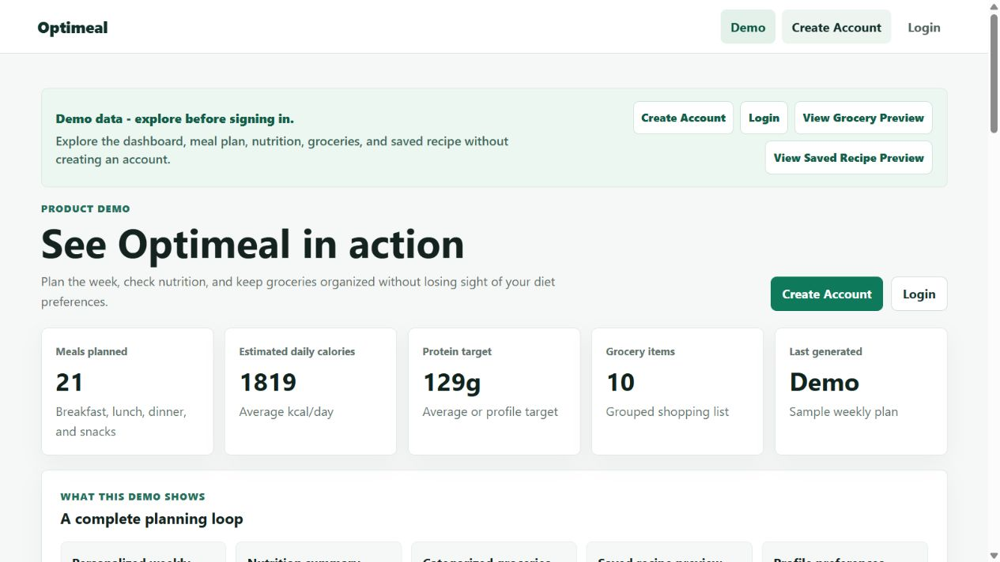
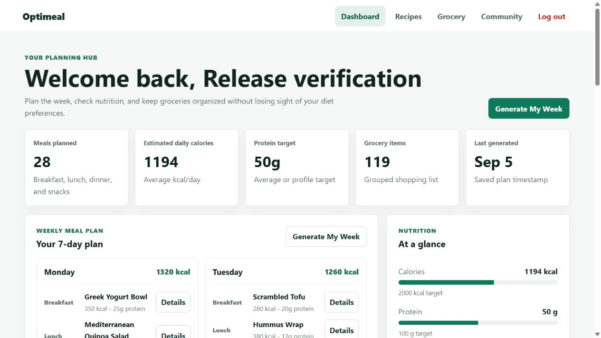
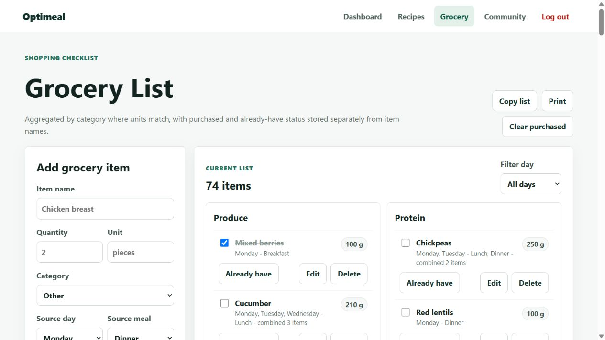
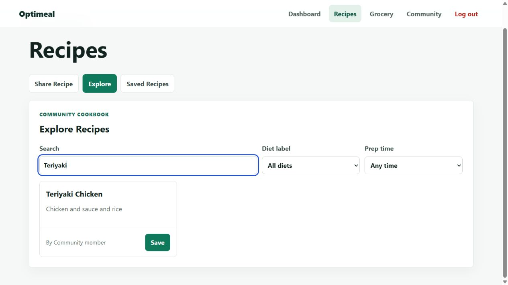

# Optimeal

AI-assisted meal planning for goals, diet preferences, nutrition, and weekly groceries.

Live app: https://optimeal-bbabb.web.app/

The September 5, 2026 release is deployed. See [release verification and known limitations](docs/release-2026-09-05.md) for test results, model routing, and deployment details. Nutrition targets guide the model but are not enforced; generated nutrition estimates and ingredient categories need review.

## Screenshots

Real screenshots of the deployed app. Authenticated views use a temporary release-test account with synthetic preferences.











## Problem

Planning meals is not just picking recipes. A useful planner needs to connect dietary preferences, nutrition targets, recipe ideas, and the grocery list people actually shop from. Optimeal brings those pieces into one Firebase-backed React app.

## Features

- Product landing page with a low-friction `Try Demo` path.
- Read-only demo dashboard with sample meal plan, nutrition summary, grocery categories, recipe preview, and profile/preferences summary.
- Authenticated dashboard for private profile, goals, meal plans, nutrition, and grocery data.
- Meal-planning profile fields for diet type, allergies, foods to avoid, cuisines, cooking skill, cooking time, budget, meals per day, servings, appliances, target calories, and target protein.
- Structured grocery items with category, quantity, unit, checked state, source day, and source meal.
- Recipe sharing, recipe explore search/filter, saved internal recipes, and external saved links.
- Community posts with per-post comments, likes, and optional image upload.
- Firestore and Storage security rules scoped to user ownership and author-owned community content.

## Tech Stack

- React 19 with Vite
- React Router
- Firebase Authentication
- Cloud Firestore
- Firebase Storage
- Firebase Hosting
- Vercel Serverless Functions for AI generation
- OpenRouter API
- Zod validation
- Vitest, Testing Library, and Node.js test runner
- npm

## Architecture

```text
React client
  -> Firebase Auth
  -> Firestore user documents, recipes, community posts
  -> Firebase Storage for community images
  -> Vercel /api/generateMealPlan for AI meal generation
  -> Firebase Hosting build output at optimeal/build
```

Optimeal stays compatible with the Firebase Spark plan:

```text
React client
  -> Firebase Auth ID token
  -> Vercel serverless function at /api/generateMealPlan
  -> OpenRouter server-side request
  -> Zod profile and meal-plan validation
  -> validated plan returned to React
  -> React saves users/{uid}.currentMeals through Firestore rules
```

Direct AI provider keys are not used in the React app. The OpenRouter key belongs only in Vercel environment variables.

The v2 AI path is intentionally split: Firebase Hosting/Auth/Firestore keep the product app on Firebase, while Vercel handles the authenticated `/api/generateMealPlan` endpoint. The endpoint verifies Firebase ID tokens, calls OpenRouter server-side, validates AI JSON with Zod, applies a daily generation limit, and returns only structured meal-plan data to React. Demo mode uses local sample data and never calls the AI backend.

## Demo Mode

Open `/demo` or click `Try Demo` on the landing page. Demo mode uses local sample data only:

- no Firebase login required
- no Firestore writes
- clearly labeled demo data
- weekly meal plan, nutrition, grocery categories, saved recipe preview, and profile/preferences summary

## Local Setup

```bash
git clone https://github.com/wjw55/optimeal.git
cd optimeal
npm ci
cd optimeal
npm ci
cp .env.example .env.local
npm start
```

Vite starts at `http://localhost:5173`. From the repository root, build and test with:

```bash
npm run build
npm --prefix optimeal run test:all
npm --prefix optimeal run build
```

The root build checks the backend and runs its tests; the frontend build produces `optimeal/build`.

## Environment Variables

See `optimeal/.env.example` for client Firebase settings.

Firebase web config can be public in a client app, but each deployed project should use its own Firebase project values and rely on Firebase rules for access control.

Client variable required by the React app:

```env
REACT_APP_MEAL_PLAN_ENDPOINT=https://your-vercel-app.vercel.app/api/generateMealPlan
```

Required Vercel environment variables:

```env
OPENROUTER_API_KEY=
OPENROUTER_MODEL=z-ai/glm-5.2:free
OPENROUTER_FALLBACK_MODEL=nvidia/nemotron-3-super-120b-a12b:free
ALLOWED_ORIGINS=https://optimeal-bbabb.web.app,https://optimeal-bbabb.firebaseapp.com
```

For local development, include the frontend origin too:

```env
ALLOWED_ORIGINS=http://localhost:5173
```

Preferred Firebase Admin credential for Vercel:

```env
FIREBASE_SERVICE_ACCOUNT_JSON=
```

Alternative split Firebase Admin credentials:

```env
FIREBASE_PROJECT_ID=
FIREBASE_CLIENT_EMAIL=
FIREBASE_PRIVATE_KEY=
```

If using `FIREBASE_PRIVATE_KEY`, keep escaped newline sequences in the environment value. The endpoint converts `\\n` to real newlines at runtime.

Do not put OpenRouter, DeepSeek, or OpenAI API keys in React `.env` files.

## AI Backend Setup

Firebase remains on Spark for:

- Hosting
- Authentication
- Firestore
- Storage

Vercel handles:

- `api/generateMealPlan.js`
- OpenRouter secret storage
- Firebase ID token verification with Firebase Admin
- Server-side profile validation
- Server-side AI JSON validation
- Optional Firestore-backed daily generation limit

The endpoint accepts only authenticated POST requests. The React client sends:

```js
Authorization: Bearer <firebase_id_token>
```

Demo mode does not call the AI endpoint and continues to use local sample data.

## AI Model Notes

`OPENROUTER_MODEL` and `OPENROUTER_FALLBACK_MODEL` are configured in Vercel, so their ordered routing can change without rebuilding React. Optimeal requests strict JSON Schema output, requires compatible providers, enables response healing, and asks OpenRouter to use the fallback when the primary provider fails. Responses have an explicit 8,192-token budget and reasoning is disabled, so configured models must support that setting. The server still validates all seven days and required meals before returning a plan. Free-provider availability and rate limits can change; a failed request shows a retry message and is never saved as a partial plan.

## Local AI Testing

1. Install frontend dependencies:

   ```bash
   cd optimeal
   npm install
   ```

2. Install root API dependencies:

   ```bash
   cd ..
   npm install
   ```

3. Create local env files:

   - `optimeal/.env.local` with Firebase web config and `REACT_APP_MEAL_PLAN_ENDPOINT=http://localhost:3001/api/generateMealPlan`
   - Vercel local env values for `OPENROUTER_API_KEY`, `OPENROUTER_MODEL`, `ALLOWED_ORIGINS`, and Firebase Admin credentials

4. Run the Vercel endpoint locally from the repository root on port `3001`, separate from Vite on `5173`:

   ```bash
   npx vercel dev --listen 3001
   ```

5. Run the React app from `optimeal/` in another terminal:

   ```bash
   npm start
   ```

6. Sign in before generating a meal plan. Demo mode works without signing in.

### Meal-generation benchmark

The benchmark uses the production request builder with synthetic profiles, runs 10 sequential OpenRouter requests, and reports schema validity, selected models/providers, fallback and healing use, response size, token usage, finish reasons, provider errors, timeouts, and p50/p90 latency. It does not use Firebase or write meal plans.

Live calls are disabled unless the confirmation flag is supplied. After approving API usage and setting the server-side OpenRouter environment variables, run:

```bash
npm run benchmark:meal-plan -- --confirm-live
```

The command exits unsuccessfully unless all 10 plans are valid, none are truncated, and p90 latency is below 45 seconds. Never place `OPENROUTER_API_KEY` in `optimeal/.env` or pass it as a command-line argument.

## Release and Deployment

The release includes the redesigned frontend and structured AI generation. Meal swaps, regenerate-day actions, and previous-plan reuse are outside this release.

Only `api/generateMealPlan.js` is a deployed API route. Shared logic lives in `lib/`, and backend tests live in `tests/api/`. Provider requests have a 45-second timeout; incomplete or truncated responses are rejected. Vercel allows 60 seconds for the whole function, and the frontend waits up to 55 seconds.

### Firebase

Firebase hosting is configured at the repository root:

```bash
firebase deploy --only hosting,firestore:rules,storage
```

To deploy only hosting after rebuilding and reviewing the React app:

```bash
npm --prefix optimeal run build
OPTIMEAL_FIREBASE_DEPLOY_APPROVED=DEPLOY_REVIEWED_CURRENT_BUNDLE firebase deploy --only hosting
```

The environment assignment above uses POSIX shell syntax. In PowerShell, set `$env:OPTIMEAL_FIREBASE_DEPLOY_APPROVED` to `DEPLOY_REVIEWED_CURRENT_BUNDLE` for the deployment command, then remove it. The guard requires comparing the current live bundle, reviewing the build, and obtaining explicit deployment approval.

`firebase.json` intentionally does not deploy Firebase Functions so the project can stay on Spark.

### Vercel Deployment

1. Connect the GitHub repo to Vercel.
2. Use the repository root as the Vercel project root so `api/generateMealPlan.js` is deployed.
3. Add the Vercel environment variables listed above.
4. Deploy the Vercel project.
5. Copy the deployed endpoint URL, for example `https://your-vercel-app.vercel.app/api/generateMealPlan`.
6. Add that URL to the React/Firebase Hosting environment as `REACT_APP_MEAL_PLAN_ENDPOINT`.
7. Rebuild and redeploy Firebase Hosting.

For an existing linked project, use `npx vercel deploy` for a preview, verify authenticated generation, then use `npx vercel deploy --prod`. Production and preview require the same server-side secrets. Vercel Secret values cannot be downloaded by `env pull`; placeholder values are not usable credentials.

If Vercel tries to build the React app unintentionally, keep the Vercel project focused on the repository root API function and leave Firebase Hosting responsible for the `optimeal/build` frontend.

## Security Notes

- Users can only read and write their own private user document.
- Recipes are readable by authenticated users, but only the author can create, update, or delete their recipes.
- Community posts are author-owned; non-authors may only update the `likes` array.
- Comments are author-owned, with post authors allowed to remove comments when deleting their own post.
- Community image uploads are limited to authenticated users writing under their own `forumImages/{uid}` path.
- `.env` files are ignored by git.
- The Vercel `generateMealPlan` endpoint verifies Firebase ID tokens before calling OpenRouter.
- The OpenRouter API key is never stored in React.
- AI output is validated with Zod before it is returned to the frontend.
- The endpoint uses Firebase Admin only for token verification, profile lookup, and rate limiting. Admin SDK writes bypass rules, so the endpoint does not save meal plans directly.

## Grocery Migration

The app can read old grocery string arrays and new structured grocery item objects. A one-time migration script is available for converting existing Firestore data.

Dry run:

```bash
cd functions
node scripts/migrateGroceryItems.js --dry-run
```

Apply:

```bash
cd functions
node scripts/migrateGroceryItems.js --apply
```

Back up Firestore before running with `--apply`. The script uses Firebase Admin application default credentials, updates only `users/{uid}.currentMeals.groceries`, and does not delete user documents.

## Future Work (Outside This Release)

- Add meal swap and regenerate-day actions.
- Add more focused component tests for demo mode and recipe filters.
- Add profile-hash plan reuse so users can choose a previous plan before regenerating the same profile.
- Optionally strengthen production rate limiting and monitoring around the Vercel endpoint.

## Suggested Repo Topics

`react`, `firebase`, `firestore`, `meal-planner`, `ai`, `nutrition`, `grocery-list`, `portfolio-project`

## Authors

- Wang Jiawei
- Neal Ng Seng Yew
